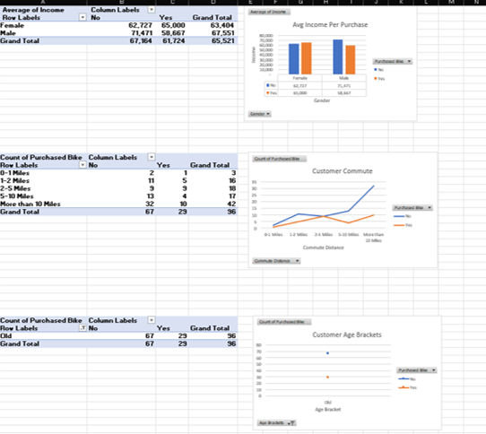

# 🚴‍♀️ Bike Sales Dashboard Analysis

## 📊 Overview

This Excel dashboard provides a detailed analysis of bike sales data, offering insights into customer demographics, purchasing behavior, and commute patterns. The goal was to make data-driven decisions clearer through a visually engaging and interactive report.

---

## 🧹 Data Cleaning

The raw data was cleaned using the following steps:
- Removed duplicate entries
- Corrected inconsistencies in gender, marital status, and region
- Converted dates and numerical fields to appropriate formats
- Created new calculated fields (e.g., Total Orders, Avg Income per Purchase)

---

## 📈 Pivot Tables

The analysis was powered by several pivot tables:
- Customer demographics by gender, region, and age
- Income per purchase by gender and education
- Commute behavior by distance
- Sales distribution by marital status and education level

---

## 💡 Key Insights

- **Total Sales**: $56.4M across **1000** orders
- **Customer Demographics**:
  - 489 Female Customers
  - 511 Male Customers
- **Average Income per Purchase**:
  - Males who purchased: $60,124
  - Females who purchased: $55,774
- **Age Distribution**:
  - Majority of customers are **Middle Aged**
- **Commute Patterns**:
  - Most customers commute **less than 2 miles**, but a significant number still travel **5–10 miles**

---

## 🧰 Tools Used

- Microsoft Excel
  - Data Cleaning
  - Pivot Tables
  - Slicers & Filters
  - Chart Visualization
- Snipping Tool (for screenshots)

---

